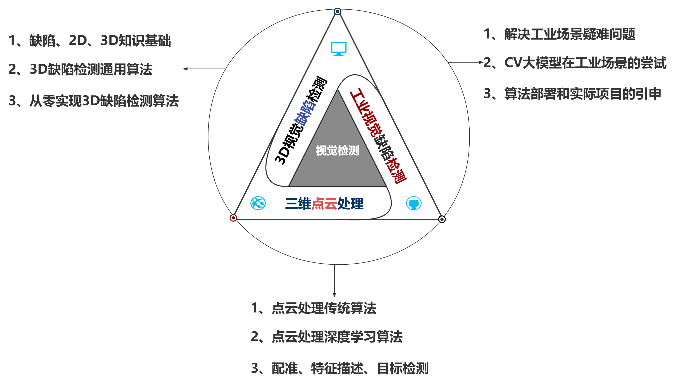

# cloud_lesson

### 思考研究意义

### 聚焦视觉检测

    

### 凝练科学问题

### 实现技术路线

### 持续技术变现

--------------------------
### 安装步骤
conda create -n cloud_lesson

conda activate cloud_lesson

conda install python=3.11

pip install open3d

pip install pyntcloud

pip install jupyterlab

jupyter lab

pip install scikit-learn

pip install seaborn

pip install opencv-python

pip install tensorflow

pip install matplotlib -i https://pypi.tuna.tsinghua.edu.cn/simple

pip install scipy

conda install pytorch torchvision torchaudio pytorch-cuda=12.1 -c pytorch -c nvidia

pip install torch-scatter -f https://pytorch-geometric.com/whl/torch-${TORCH}+${CUDA}.html
pip install torch-sparse -f https://pytorch-geometric.com/whl/torch-${TORCH}+${CUDA}.html
pip install torch-cluster -f https://pytorch-geometric.com/whl/torch-${TORCH}+${CUDA}.html
pip install torch-spline-conv -f https://pytorch-geometric.com/whl/torch-${TORCH}+${CUDA}.html
pip install torch-geometric

### 数据集
modelnet40，文件格式是txt
kitti，文件格式是bin文件

