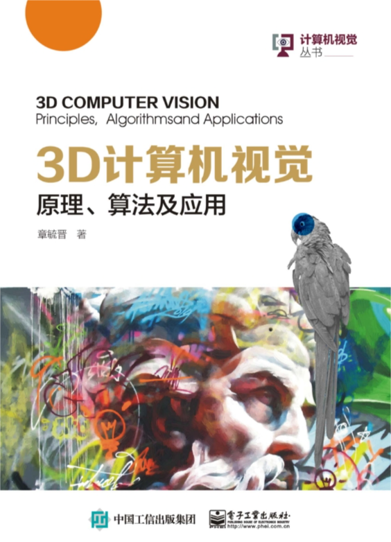

<!--
 * @Author: wangwei83 wangwei83@cuit.edu.cn
 * @Date: 2024-05-27 15:00:27
 * @LastEditors: wangwei83 wangwei83@cuit.edu.cn
 * @LastEditTime: 2024-05-27 20:35:14
 * @FilePath: /wangwei/X-23d-Y-ai-Z-detection/README.md
 * @Description: 这是默认设置,请设置`customMade`, 打开koroFileHeader查看配置 进行设置: https://github.com/OBKoro1/koro1FileHeader/wiki/%E9%85%8D%E7%BD%AE
-->
# 工业三维视觉检测

## 思考研究意义

<div align="center">
    
</div>

## 聚焦视觉检测

<div align="center">
    
</div>

## 凝练科学问题

1. **特征提取**：如何有效地从大量的三维数据中提取有用的特征？
2. **模型设计和训练**：如何设计和训练深度学习模型以实现精确的三维物体检测？
3. **数据处理**：如何处理不同的视觉传感器（如激光雷达、立体相机等）获取的数据？
4. **旋转不变性**：如何处理三维数据的旋转不变性问题？
5. **实时性**：如何提高三维视觉检测的实时性，以满足工业应用的需求？
6. **大规模和复杂场景**：如何处理大规模、复杂场景下的三维视觉检测问题？
7. **少量或无标注数据的训练**：如何利用少量标注数据或无标注数据进行有效的模型训练？

## 实现技术路线

## 持续技术变现

## 基础理论知识

<div align="center">
    
</div>

<div align="center">
    
</div>

---

## 安装步骤

```bash
conda create -n cloud_lesson
conda activate cloud_lesson
conda install python=3.11
pip install open3d
pip install pyntcloud
pip install jupyterlab
jupyter lab
pip install scikit-learn
pip install seaborn
pip install opencv-python
pip install tensorflow
pip install matplotlib -i https://pypi.tuna.tsinghua.edu.cn/simple
pip install scipy
conda install pytorch torchvision torchaudio pytorch-cuda=12.1 -c pytorch -c nvidia
pip install torch-scatter -f https://pytorch-geometric.com/whl/torch-${TORCH}+${CUDA}.html
pip install torch-sparse -f https://pytorch-geometric.com/whl/torch-${TORCH}+${CUDA}.html
pip install torch-cluster -f https://pytorch-geometric.com/whl/torch-${TORCH}+${CUDA}.html
pip install torch-spline-conv -f https://pytorch-geometric.com/whl/torch-${TORCH}+${CUDA}.html
pip install torch-geometric

数据集
modelnet40，文件格式是txt
kitti，文件格式是bin文件